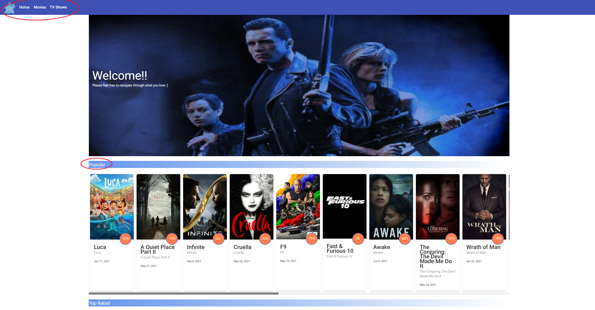
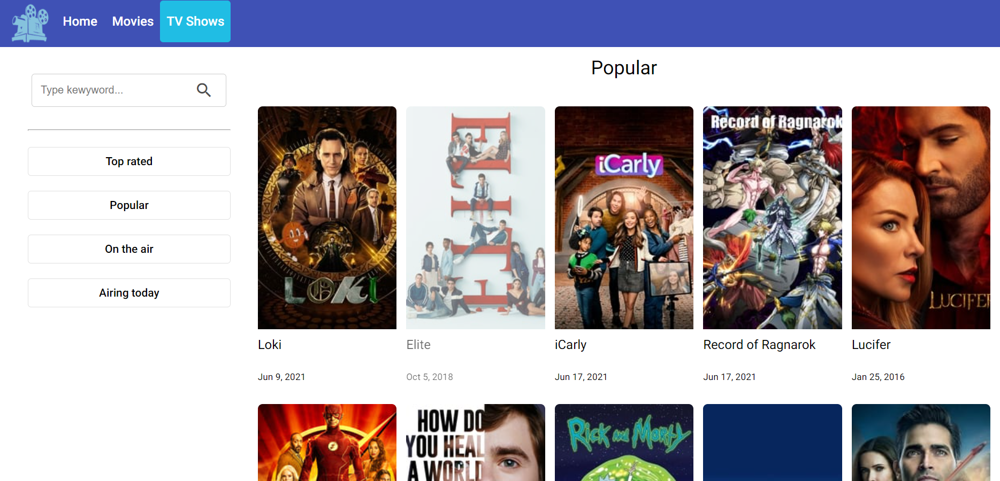
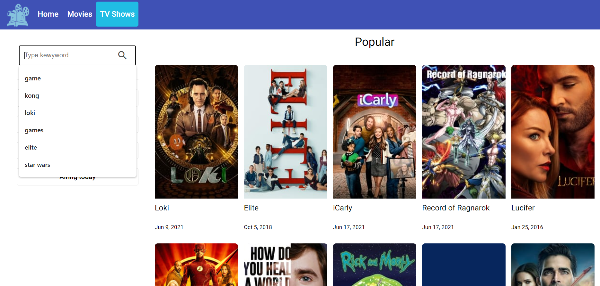
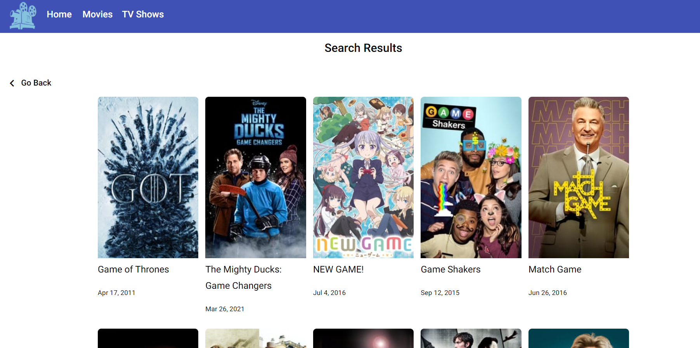
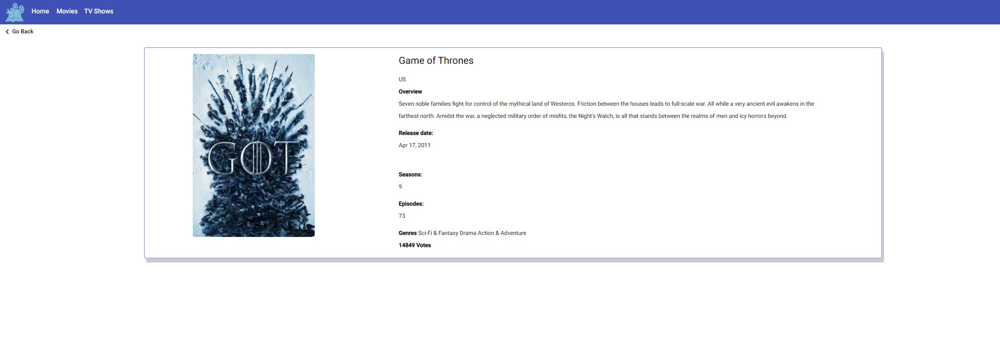

# TMDB

This is a responsive web application that allow you to navigate and search among movies and tv shows.
Technologies:

Angular 11,
Angular Material,
CSS 3,
HTML 5

## Development server
Run `ng serve` for a local dev server. Navigate to http://localhost:4200. The app will automatically reload watching for any file changes

## Build
Run `ng build` to build the project as a development solution. 
The build artifacts will be stored in the `dist/` directory. Use the --prod flag for a production build.

## Usage

Getting information from the external API through Angular HttpClient accesor

Services:

Movie - Endpoints
```
 getMovies(movieType: string): Observable<MovieRootObject>{
    return this.httpClient.get<MovieRootObject>(`https://api.themoviedb.org/3/movie/${movieType}?api_key=<<api-key>>&language=en-US&page=<<pageNumber>>`);
  }

  getLatest(): Observable<LatestRootObject>{
    return this.httpClient.get<LatestRootObject>('https://api.themoviedb.org/3/movie/latest?api_key=<<api-key>>&language=en-US');
  }

  getMoviesPag(movieType: string, pageNumber: string): Observable<MovieRootObject>{
    return this.httpClient.get<MovieRootObject>(`https://api.themoviedb.org/3/movie/${movieType}?api_key=<<api-key>>&language=en-US&page=<<pageNumber>>`);
  }

  getMovieDetails(id: string): Observable<MovieDetails>{
    return this.httpClient.get<MovieDetails>(`https://api.themoviedb.org/3/movie/${id}?api_key=<<api-key>>&language=en-US`);
  }

  getGenres(): Observable<GenreRootObject>{
    return this.httpClient.get<GenreRootObject>("https://api.themoviedb.org/3/genre/movie/list?api_key=<<api-key>>&language=en-US");
  }
  
  getGenresById(id:string[]): Observable<MovieRootObject>{
    return this.httpClient.get<MovieRootObject>(`https://api.themoviedb.org/3/discover/movie?api_key=<<api-key>>&with_genres=<<id>>`);
  }
```
Search - Endpoints (Movies - TV Shows)
```
getSearchMovies(keyword: string, pageIndex: string): Observable<MovieRootObject>{
    return this.httpClient.get<MovieRootObject>(`https://api.themoviedb.org/3/search/movie?api_key=<<api-key>>&language=en-US&query=<<keyword>>&page=<<pageIndex>>&include_adult=false`);
  }

  getSearchTvShows(keyword: string, pageIndex: string): Observable<RootTvShow>{
    return this.httpClient.get<RootTvShow>(`https://api.themoviedb.org/3/search/tv?api_key=<<api-key>>&language=en-US&query=<<keyword>>&page=<<pageNumber>>&include_adult=false`);
  }

  getSearchResults(keyword: string, pageIndex: string, searchType: string): Observable<any>{
    if(searchType === 'tvShows'){
      return this.httpClient.get<RootTvShow>(`https://api.themoviedb.org/3/search/tv?api_key=<<api-key>>&language=en-US&query=<<keyword>>&page=<<pageIndex>>`);
    }else{
      return this.httpClient.get<MovieRootObject>(`https://api.themoviedb.org/3/search/movie?api_key=<<api-key>>&language=en-US&query=<<keyword>>&page=<<pageIndex>>&include_adult=false`);
    }
  }

```

TV Shows - Endpoints
```
 getLatest(): Observable<RootTvShow>{
    return this.httpClient.get<RootTvShow>('https://api.themoviedb.org/3/tv/popular?api_key=<<api-key>>&language=en-US&page=1')
  } 

  getTvShowDetails(id: string): Observable<TvShowDetail> {
    return this.httpClient.get<TvShowDetail>(`https://api.themoviedb.org/3/tv/${id}?api_key=<<api-key>>&language=en-US`);    
  }

  getTvShowsPag(tvShowType: string, pageNumber: string): Observable<RootTvShow>{
    return this.httpClient.get<RootTvShow>(`https://api.themoviedb.org/3/tv/<<tvShowType>>?api_key=<<api-key>>&language=en-US&page=<<pageNumber>>`);
  }

  getTvShows(tvShowType: string): Observable<RootTvShow>{
    return this.httpClient.get<RootTvShow>(`https://api.themoviedb.org/3/tv/<<tvShowType>>?api_key=<<api-key>>&language=en-US&page=<<pageNumber>>`)
  }
```

## Usage Interface
Clickable

Movies section (reused by Tv Shows)

Search menu, write a keyword for movies and for tv shows

Searchs results

Movie and TV shows details, clicking on card


## Contributing
Pull requests are welcome. For major changes, please open an issue first to discuss what you would like to change.

Please make sure to update tests as appropriate.

## License
[MIT](https://choosealicense.com/licenses/mit/)
